# Encoders for ETC Eos Hardware

This folder contains all the design files required to build the Encoders for [ETC Eos][etceos] hardware.

The PCB layout and acrylic case aligment was done using [KiCad 5.1][kicad]. The PCB and case was 3D modelled using [FreeCAD v0.18][freecad] and the [KiCAD StepUp plugin][kicad-stepup].

This is an independent project that is designed to work with the [ETC Eos][etceos], but not affiliated with Electronic Theatre Controls in any way.

- [Encoders for ETC Eos Hardware](#encoders-for-etc-eos-hardware)
  - [Installation](#installation)
    - [Step 1: Order PCB, Parts and Acrylic Case](#step-1-order-pcb-parts-and-acrylic-case)
      - [PCB](#pcb)
      - [Electronic Parts](#electronic-parts)
      - [Acrylic Case](#acrylic-case)
      - [Extras](#extras)
    - [Step 2: Assemble the PCB](#step-2-assemble-the-pcb)
    - [Step 3: Fit off the case](#step-3-fit-off-the-case)
    - [Step 4: Upload Firmware](#step-4-upload-firmware)
      - [Using TyTools](#using-tytools)
      - [Using Teensyduino](#using-teensyduino)
    - [Step 5: Test](#step-5-test)
  - [Issues](#issues)
  - [Contributing](#contributing)
  - [Credits](#credits)
  - [License](#license)

## Installation

### Step 1: Order PCB, Parts and Acrylic Case

#### PCB

The schematic and PCB files were built using KiCad 5.1. But you only need the PCB Gerbers located in [EncoderBoard_RevA_Gerbers](./EncoderBoard_RevA_Gerbers/) to order your PCB. I ordered a black PCB so it matched(-ish) the black of my acrylic case.

#### Electronic Parts

A list of the required components can be found in the BOM folder in either [csv](bom/EncoderBoard_revA.csv) or [xlsx](bom/EncoderBoard_revA.xlsx) format.

- You may need to choose an encoder with a different shaft height than the 20mm I used depending on the internal height of your encoder knobs and space taken up by the acrylic case.
- Don't forget 0.1" headers to solder the Teensy and OLEDs to the PCB.
- Be sure to pay special attention to the component package size on the PCB (and listed in the BOM spreadsheet) when choosing your resistors, capacitors and ICs.
- I sourced most of my components from Digikey or Mouser. You may wish to source the Teensy directly from PJRC (or a distributor) and the WS2812B LEDs and 128x32 OLED displays may be easier and cheaper to source from somewhere like AliExpress. Just be sure the pins are in the same order as the PCB expects!

#### Acrylic Case

The laser-cut acrylic case is quite an expensive solution compared to off-the-shelf enclosures, but it keeps the encoder case slender and elegant.

- The case has five layers:\
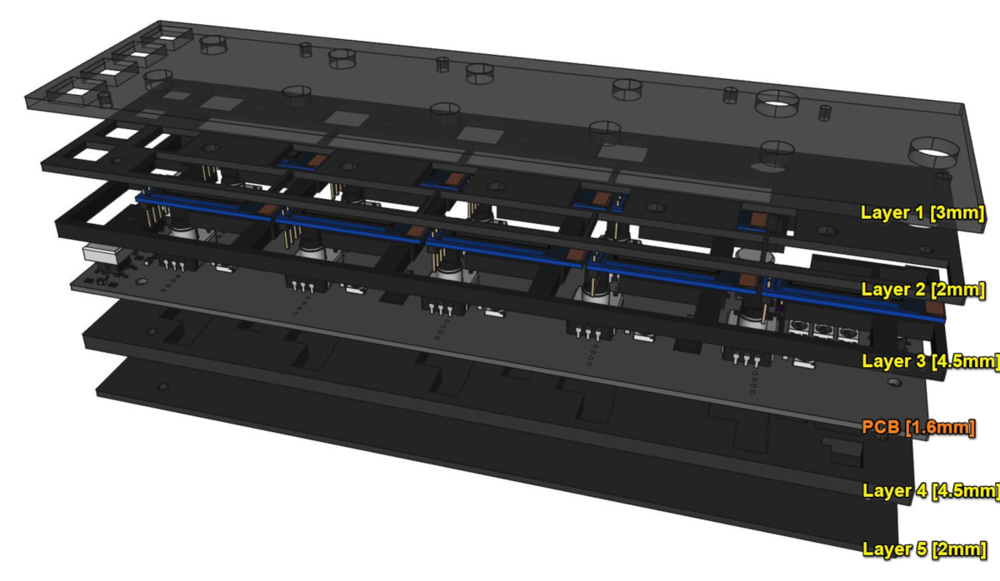
  - Layer 1: The top (clear or semi-transparent) layer - 3mm to bring the total height of the case flush with the push buttons.
  - Layer 2: This is the middle layer of the three above-the-PCB layers. It has cutouts only for the components that need to be visible or poke through the top (transparent) layer: encoders, buttons, LEDs, displays and screw holes.
  - Layer 3: This is essentially a spacer between the PCB and layer 2 so none of the electronic components get in the way. It needs to be thicker than the height of your tallest component - 4.5mm was used in the drawings.
  - Layer 4: This is the spacer for your electronic components on the rear side of the board. 4.5mm acrylic was chosen to match that of layer 3.
  - Layer 5: This is a cover plate for the rear side - 2mm was selected to match that of layer 2.
- You should be able to order the acrylic from your local laser-cutter supplier. Make sure the requirements in file format and line colours from your laser cutter matches what is supplied. You can find various files in the [SVG folder](SVGs) that show the cutouts in a few different layouts.

#### Extras

- Some M2.5 screws that are just the right length for all 5 layers + the PCB (1.6mm usually) + nut. I used screws with a 20mm thread and 3mm thick nuts.
- Some rubber feet that are at least a little deeper than your screw/nut protudes below the case.
- Knobs for the encoders (check the internal height of the encoder will suit the encoder shaft height).
- Button caps for the push buttons.

### Step 2: Assemble the PCB

- Solder all parts **except the OLED displays** to the PCB. I found it easier to do the underside SMT parts first and then the top side SMT parts and finally the PTH parts. The [Interactive HTML BOM page](bom/BOM%20-%20Encoder%20Board,%20Rev%20A.html) in the bom folder should assist when placing components.

  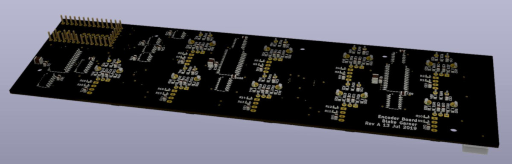
  
  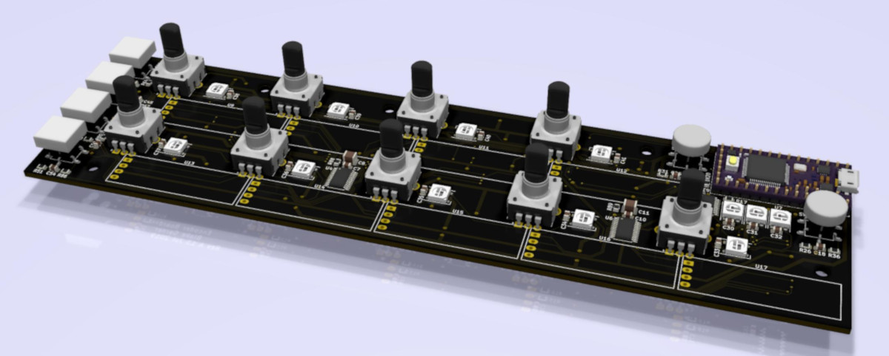
  - **DON'T DO THE OLED DISPLAYS YET!** Layer three of the acrylic case needs to go down first.
  - Make sure the Teensy sits within the height of your Layer 3 acrylic (4.5mm).
  - If you've not done SMT soldering before, you may want to practice on a smaller project before attempting this one. SMT soldering is not as hard as it looks but some practice before-hand is advised!
  - Be extra careful with the alignment of the encoders and push buttons when soldering them in place. If they don't line them up perfectly they will likely scrape against the side of the case and not operate correctly.

- Double check all your soldering work - checking for shorts, missing joints or ICs/diodes in the wrong orientation. Even though the OLEDs are not fitted, it is okay to power on the system to check everything else at this point. I used one spare OLED with pogo-pins fitted that I could then use to check each OLED output one-by-one.
- Place Layer 3 of the acrylic case on top of the PCB. Check the sections that will sit under the OLEDs will not force the OLEDs to sit proud of layer 2 - I had to sand those spacers down about one millimeter to reduce the height on the OLEDs. Temporarily hold layer 3 and the PCB together using a few screws.\
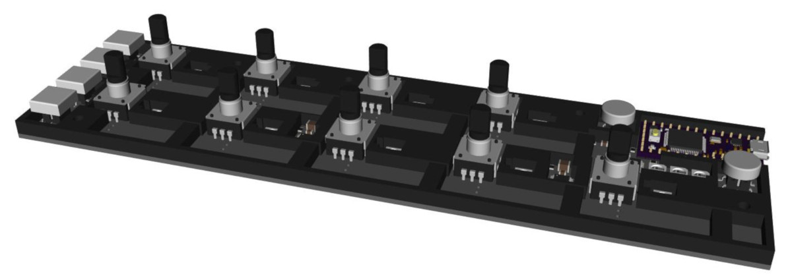
- Solder the OLEDs in place, ensuring they will not sit any taller than layer 2 of the acrylic pieces when fitted. Also note that from now on, layer 3 will be fixed in place, and it will no longer be possible to service or re-solder most of the top-mounted SMT components.\
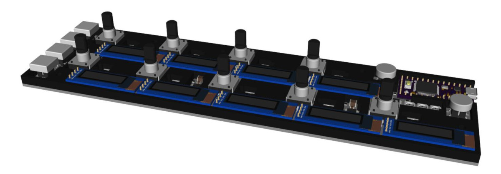

### Step 3: Fit off the case

- Remove any temporary screws holding layer 3 in place, then stack the remaining acrylic layers together and screw the five pieces of acrylic + PCB together. Be gentle when tightening the nuts as the acrylic will crack if placed under stress.\
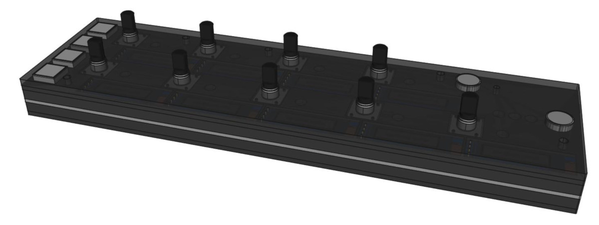
- Snap the knobs and button caps in place.\
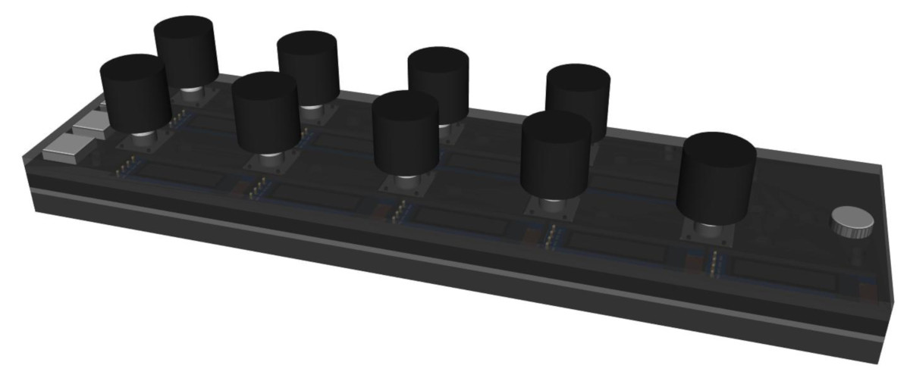

### Step 4: Upload Firmware

- You need TyCommander or Teensyduino to upload the firmware to the Teensy. TyCommander is a simpler install, but Teensyduino is fine if you already have that installed.

#### Using TyTools

- Download [TyTools][tyTools] and extract it somewhere convenient.
- Start up TyCommander.exe
- Plug in the Teensy on the encoder board.
- Place the Teensy board in programming mode by pressing the push-button on top of the Teensy (still accessible using a paperclip with the case in place).
  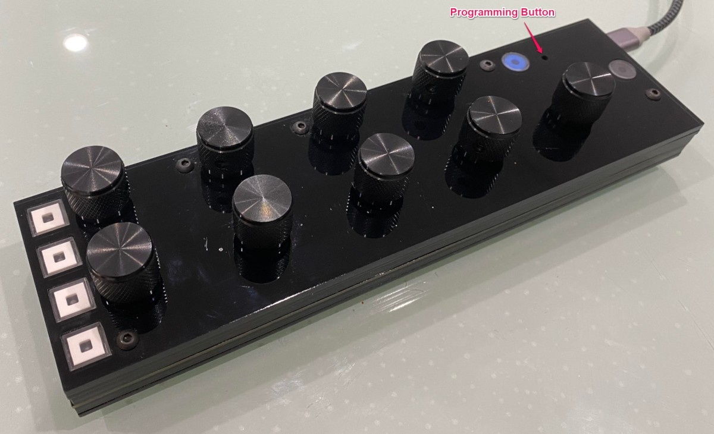
- The Teensy should show as in bootloader mode and the upload button should become available. Click the drop-down menu on the upload button and choose "Upload New Firmware".\
  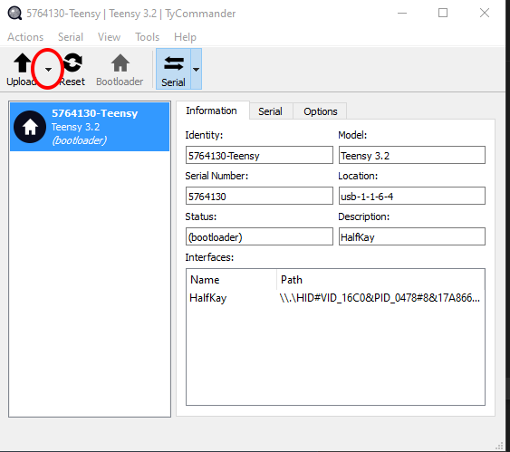
- Navigate to this project folder and select the Firmware_x.x.x.hex file in the [Firmware folder](../Firmware) that matches the version you want to upload (probably the latest version).\
  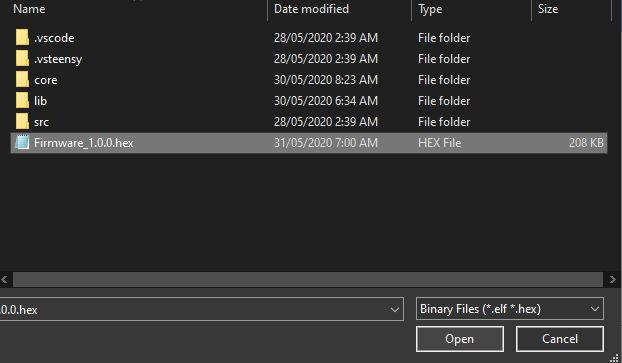
- The firmware will take a couple of seconds to upload, and then the board should automatically reboot.

#### Using Teensyduino

- Download the latest Arduino software from the [Arduino website][arduino], and install it.
- Download the latest Teensyduino software from the [PJRC website][teensyduino], and install it.
- Open the Teensy.exe file from the Teensyduino installation directory, or via the Arduino software.
- Click the "Open HEX File" button.\
  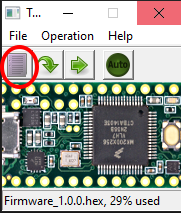
- Navigate to this project folder and select the [Firmware_x.x.x.hex file in the Firmware folder](../Firmware) that matches the version you want to upload (probably the latest version).
- Place the Teensy board in programming mode by pressing the push-button on top of the Teensy (still accessible using a paperclip with the case in place).\

- Program the Teensy by pressing the Program button in the Teensy utility.\
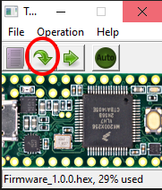
- Reset the Teensy by pressing the Reset button in the Teensy utility. The board should then reboot and start up as normal.\
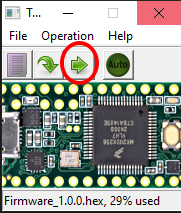
- Note: If the Auto button is enabled on the Teensy app, it will do the program + reset as soon Teensy is placed into programming mode.

### Step 5: Test

The encoder board should now be working. Connect it to an Eos family console, or ETCnomad software as [described on the home page](../README.md) and give it a spin!

## Issues

- In revA of the board, there are some missing pull-up resistors for the push buttons that need to be bodged onto the PCB - it's a real pain to fix, so better to fix that before getting the PCB printed.
- Some of the acrylic can be a tight fit, depending on your laser-cutter's tolerances. Best to approach the fitting of the board on a day when you have plenty of paitence! I will try to make it more forgiving in later revisions.
- See the [Todo text file](Todos%20for%20RevB.txt) for a list of issues found when building the most recent revision of the board, as well as desired improvements for future versions.

## Contributing

Contributions are most welcome!
Please log an issue and/or pull request for any bugs or feature changes you may wish to share.

## Credits

[ETC LightHack][lighthack] which formed the basis and initial inspiration for this project

## License

All hardware files (inside `EncoderBoard`) and original source code (inside `Firmware/src`) uses the Apache 2.0 license. See [LICENSE](LICENSE) for more information.

Libraries inside `Firmare/lib` and `Firmware/core` have been licensed separately by their respective authors and include a mixture of BSD, MIT, public domain, LGPLv2 and other licenses. More information on each can be found in the relevant source files.

[lighthack]: https://github.com/ETCLabs/lighthack
[etceos]: https://www.etcconnect.com/Products/Consoles/Eos-Family/

[arduino]: https://www.arduino.cc/en/Main/Software
[teensyduino]: https://www.pjrc.com/teensy/td_download.html
[tyTools]: https://github.com/Koromix/tytools/releases

[kicad]: https://kicad-pcb.org/download/
[freecad]: https://www.freecadweb.org/downloads.php
[kicad-stepup]: https://wiki.freecadweb.org/KicadStepUp_Workbench/it
